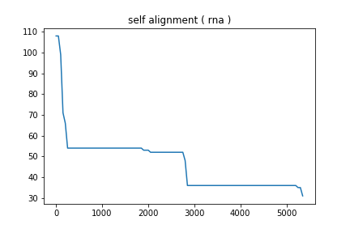
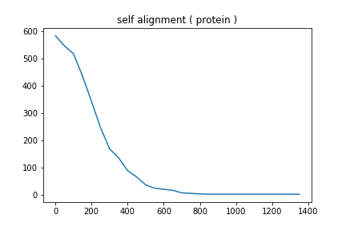
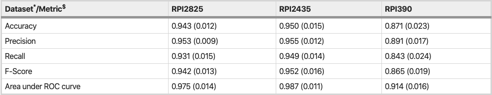
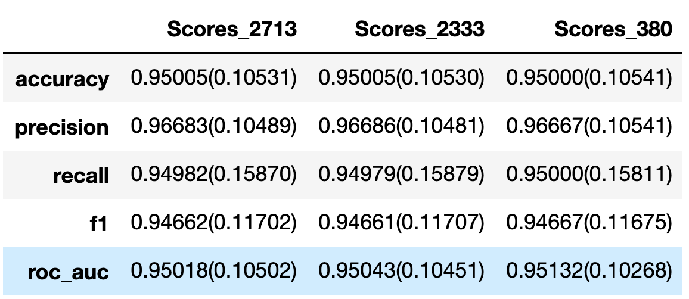

# rpi-predict

  A data driven model for RNA Protein Interaction prediction using the BLAST sequencing tool and a gradient boosting  classifier.  
  

# Data
953 RNA-protein complexes with a resolution of ≤3 Å were deposited in the Protein Data Bank30 (www.rcsb.org). Out of the 953 complexes, 351 complexes were rejected due to the absence of any valid RNA or protein chain. Any RNA and protein chain in a given complex is classified as interacting if the distance between any pair of atoms of these two chains is less than 8 Å (this distance cut off was used to account for interactions involving bridging water or ion molecules). This resulted in a non-redundant dataset of 2825 unique RNA-protein interacting pairs (RPI2825). Since the RNA protein complex structures deposited in PDB are mostly ribosomal complexes, the RPI2825 is split into two parts: RPI2435 and RPI390 containing only the ribosomal RPIs and the non-ribosomal complexes respectively

&nbsp;

# Feature Synthesis
The features have been generated using the standard k-mer representation. The amino acids have been classified into four categories and the nucleotides retain their individual monomers. This classification was a result of the interaction propensity calculations performed on data obtained from experimentally determined crystal structures (see Methods). The interface size for interactions or the window size (k) for the feature generation is defined as a Minimal Structural Unit (MSU) equal to five. The resulting k-mer representations of the RNA and protein sequences are concatenated to form a single feature vector which is then fed into the XGBoost model

  

&nbsp;

# Negative dataset
As a negative dataset consists of pairs of RNA Protein that will not interact we need to create a negative dataset based on a set of assumptions. The process used for the creation was to take every possible combination of an RNA and protein in the positive dataset and reduce the sample size based on a set of assumptions:
1. Pairs found in the positive dataset were removed from the set.
2. Every pair left is taken. For a given set of an RNA paired with a protein, a database is formed using a **BLAST Command Line Tool** of all the proteins the RNA is paired with in the positive dataset and the current paired protein is queried against the database. If the query finds any hit ( for the default E-value = 1 ) the given pair of RNA and protein is disregarded. The same is preformed in the reverse order( Protein with RNA database ).
3. Every RNA is queried against a database of all the other RNAs. The result is a list of values of how similar each RNA is to its other RNAs in the dataset based on their BLAST scores. The same is performed for proteins.

  
  

The above graphs indicates the the no of RNA and proteins above a particular BLAST score. As we want to maximize the diversity of the data we have, we only remove the the RNA and proteins with an excessively high BLAST score. The scores were manually set to 500 for protein and 3000 for RNA. 
4. From the remainig pairs a random subsample was taken of length equal to the positive dataset.

&nbsp;

# XGBoost Classifier
We used the implementation provided in the XGBoost Python library which is optimized for distributed systems. The XGBoost model was trained using 200 estimators and a learning rate (η) of 0.25 with each tree having a maximum depth of eight. The L1 regularization parameter was set using cross-validation to 1.12 and the L2 regularization parameter was set to 18.51 before training. The sub-sample ratio was set to 0.9 and the loss function to be optimized was the “binary:logistic” function, otherwise known as the log-loss function, which is well suited for binary classification tasks. Parameter optimization and evaluation of the models is done using 10-fold nested cross-validation.

&nbsp;

# Evaluation Metrics
We have used the following metrics to assess the performance of the method. Where, TP is true positives, TN is true negatives, FP is false positives, and FN stands for false negatives.

  

  Scores without BLAST allignment 

  

  Scores without BLAST allignment

  

